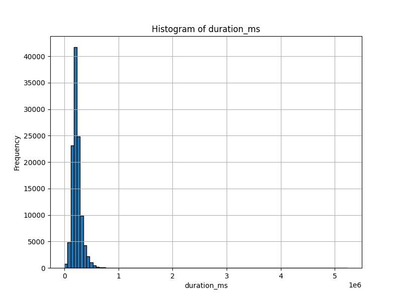
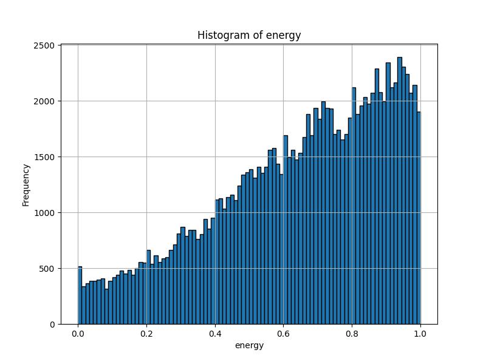
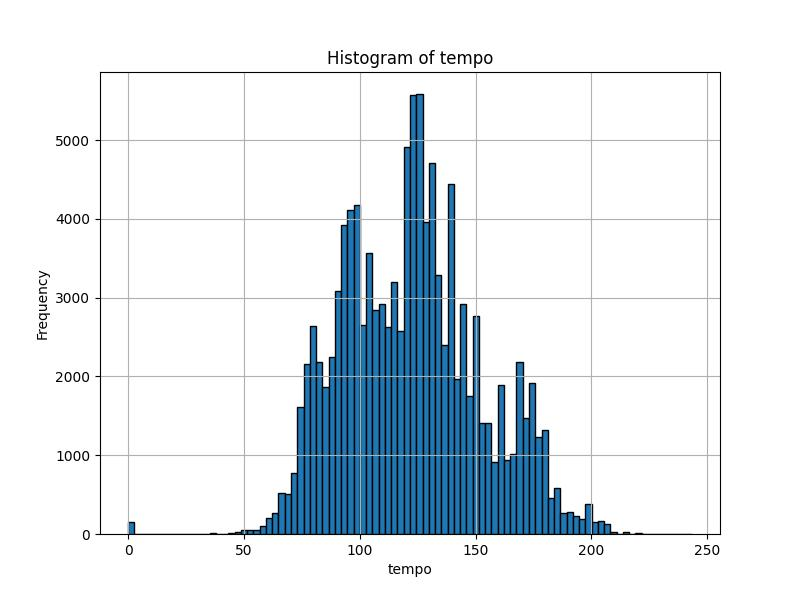
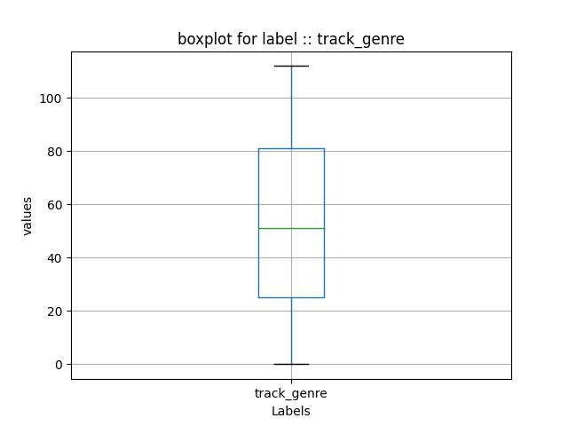

# Assignment 1 Report
This doccument conntains the bare-bones implementaion of the K Nearest Neighbours Classification algorithm, as well as a Linear Rregression Algorithm.

They have been run to perform multiple tasks over a given dataset. Various metric-checks and evaluations have been performed and tested over the models.

## Running The Code

## Running The Code

To Run all the subparts one after the other:
```console
    python3 -m assignments.1.a1
```

To run the subparts individually:
```console
    python3 -m assignments.1.a1-<knn or lr> <-q> or <--question> <subpart>
```

example for Linear Regression second subpart:
```console
    python3 -m assignments.1.a1-lr -q 2
```

## Model Description

### KNN 
The KNN model has been implemented here:
- models
    - knn
        - knn.py

The `KNN` class inherits from `Metrics` class which in turn inherits from the `Data` class

This ensures that in our main file `a1-knn.py` we need to initialize only one object.

These classes contain most of the functionalities required for running tests and metric checks

### LinearRegressor
The KNN model has been implemented here:
- models
    - linearRegression
        - linearRegression.py

The main functionality is from the `run()` method and the `GIFplots()` method

## KNN - DATA EXPLORATION

In this section we aim visualize the data and understand its structure

This section of the Assignment can be accessed as such:
```console
    python3 -m assignments.1.a1-lr -q 1
```

### Raw data
We plot histograms to see the frequency distribution of the various numerical data in the dataset









### Post Processing

#### Correlation Matrix

After the Processing of the data, we can see the correlation of the numerical data with each other in this form :


#### Box Plots





## KNN-Implementation
The KNN class and its structure have been exlained above.
upon running this class we can see the performance of the model :

```console
    python3 -m assignments.1.a1-lr -q 2
```
This calls the `Macro` class which computes the Macros for the different parameters.

Consistently the model performs as such: 

for K = 1 and metric = 'euclid'
| Metric       | Value            |
|--------------|------------------|
| Accuracy     | 0.3675           |
| Precision    | 0.3625           |
| Recall       | 0.3582           |
| F1-score     | 0.3579           |

## KNN-Hyperparameter Tuning

This section of the Assignment can be accessed as such:
```console
    python3 -m assignments.1.a1-lr -q 3
```

In general the top 10 K-metric we get are :

| k  | Metric   | Accuracy |
|----|----------|----------|
| 9  | manhattan| 0.4674   |
| 8  | manhattan| 0.4653   |
| 7  | manhattan| 0.4643   |
| 6  | manhattan| 0.4606   |
| 5  | manhattan| 0.4534   |
| 4  | manhattan| 0.4343   |
| 1  | manhattan| 0.4333   |
| 3  | manhattan| 0.4161   |
| 2  | manhattan| 0.3956   |
| 9  | euclid   | 0.3748   |


## KNN-OPTIMIZATION
The KNN class contains Two implementations of the `predict` function, one is optimized using vectorization

The performance of the two models versus the defaut `sklearn.KNNclassifier` method is shown as follows:


We have also evaluated this for different percentages of the train dataset


## KNN-Second Dataset
The KNN model has also been run for a second dataset where the splits are explicitly given.
Here however in the `test.csv` dataset, one of the `track_genres` are missing. Thus mormalizing individually skews the label encoding and results in incorrect prediction and poor accuracy.

Thus to counter this, the individual splits have been concatenated into a single dataset, processed as a whole and then re-split in the same ratios

The model performs as such on this dataset:
| Metric       | Value            |
|--------------|------------------|
| Accuracy     | 0.2595           |
| Precision    | 0.2600           |
| Recall       | 0.2503           |
| F1-score     | 0.2444           |


## Linear Regression - Degree 1
The first check on our Regression model is to see if it fits a linear curve to the given data:


## Linear Regression - Degree > 1
Next we check on our Regression model running with polynomials of degree upto 6


`as seen above, the MSE, STD and VAR for all degrees are in the plots`

## Linear Regression - Visualising the process
The training process has been visualised for polynomials of degree 1 to 5 as shown:

### Degree 1

### Degree 2

### Degree 3

### Degree 4

### Degree 5


## Linear Regression - Regularisation
We have fitted the data for polynomials up to degree 20
using `L2` regularisation with `self.lambda = 20`

as such we have got the following plots:


