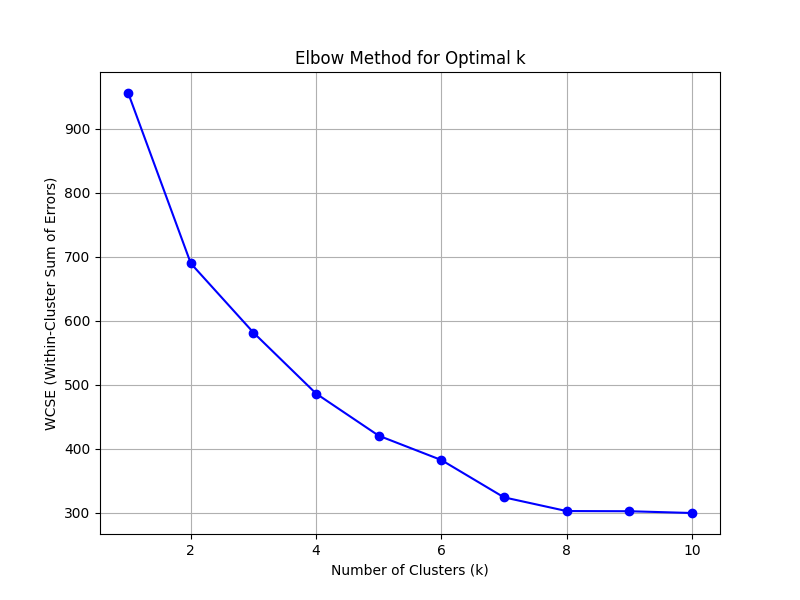

# Assignment 2 Report

# Running the code
All the tasks can be accessed one after another through this command in main folder
```console
python3 -m assignments.2.a2
```

# K-Means Clustering

## Aim

Implement a K-Means clustering algorithm to sort data into clusters.

## Theory

K-Means Clustering is an unsupervised machine learning algorithm used to partition data into `K` distinct clusters. Each cluster consists of data points that are similar to each other, with similarity typically measured using distance metrics. In this implementation, the Euclidean distance metric is used.

## Task 1: Determine the Optimal Number of Clusters for 512 Dimensions

individually run as:
```console
python3 -m assignments.2.task3.1
```

To determine the optimal number of clusters, we use the Elbow Method. 

We fit the K-Means algorithm on the data for a range of cluster numbers (e.g., from 1 to 10) and for each `K`,we compute the WCSS. The formula for WCSS is:

   $$ \text{WCSS} = \sum_{i=1}^{K} \sum_{x \in C_i} \|x - \mu_i\|^2$$

   where $(C_i)$ is the set of points in cluster $i$, and $(\mu_i)$ is the centroid of cluster $i$.

Plotting the WCSS against K we get the following plot.

   


   In the plot above, the elbow point is observed at `K=4`. Thus, we set `K` to 4 for the K-Means clustering algorithm (`kmeans1 = 4`) and proceed with clustering.

```console
python3 -m assignments.2.task3.2
```


# Gaussian Mixture Models
## Aim

Implement a Gaussian Mixture Model (GMM) to identify and sort data into clusters.

## Theory

Gaussian Mixture Models (GMMs) are a type of probabilistic model used for clustering and density estimation. Each of the `K` Gaussian distribution represents a cluster, and the model estimates the parameters for these distributions. The data points are assigned to the cluster based on their probability of being present in the cluster. The GMM algorithm uses Expectation-Maximization (EM) to iteratively estimate the parameters.

The EM algorithm alternates between assigning data points to clusters (Expectation step) and updating the parameters of the Gaussian distributions (Maximization step).

### Expectation Step
Calculating $\gamma_{nk}$ is the Expectation Step, the responsibility $\gamma_{nk}$ represents the probability that a data point $x_n$ belongs to cluster $k$. It is given by:

$$ \gamma_{nk} = \frac{\pi_k \mathcal{N}(x_n \mid \mu_k, \Sigma_k)}{\sum_{j=1}^{K} \pi_j \mathcal{N}(x_n \mid \mu_j, \Sigma_j)} $$

where:
- $\pi_k$ is the prior probability (weight) of cluster $k$.
- $\mathcal{N}(x_n \mid \mu_k, \Sigma_k)$ is the Gaussian probability density function for cluster $k$, given by:

  $$ \mathcal{N}(x_n \mid \mu_k, \Sigma_k) = \frac{1}{(2 \pi)^{d/2} |\Sigma_k|^{1/2}} \exp \left(-\frac{1}{2} (x_n - \mu_k)^\top \Sigma_k^{-1} (x_n - \mu_k)\right) $$

  where:
  - $\mu_k$ is the mean vector of cluster $k$.
  - $\Sigma_k$ is the covariance matrix of cluster $k$.
  - $d$ is the number of dimensions of the data.


### Maximization Step
Updating the parameters of the GMM is the Maximization Step

   $$ \pi_k = \frac{1}{N} \sum_{n=1}^{N} \gamma_{nk} $$


   $$ \mu_k = \frac{\sum_{n=1}^{N} \gamma_{nk} x_n}{\sum_{n=1}^{N} \gamma_{nk}} $$


   $$ \Sigma_k = \frac{\sum_{n=1}^{N} \gamma_{nk} (x_n - \mu_k) (x_n - \mu_k)^\top}{\sum_{n=1}^{N} \gamma_{nk}} $$

   N is the total number of data points

### Log-Likelihood

The log-likelihood measures how well the model fits the data. For GMM, it is given by:

$$ \text{Log-Likelihood} = \sum_{n=1}^{N} \log \left( \sum_{k=1}^{K} \pi_k \mathcal{N}(x_n \mid \mu_k, \Sigma_k) \right) $$


## Task 1: Determine the Optimal Number of Clusters for 512 Dimensions

Choosing the optimal number of clusters for GMM involves evaluating different numbers of clusters and selecting the one that best balances model fit and complexity. This can be achieved using model selection criteria such as the Akaike Information Criterion (AIC) and the Bayesian Information Criterion (BIC).


### AIC and BIC Formulas

- **AIC (Akaike Information Criterion)**:
  $$ \text{AIC} = -2 \cdot \text{Log-Likelihood} + 2 \cdot \text{Number of Parameters} $$

- **BIC (Bayesian Information Criterion)**:
  $$ \text{BIC} = -2 \cdot \text{Log-Likelihood} + \text{Number of Parameters} \cdot \log(n) $$

  where:
  - Log-Likelihood measures how well the model explains the data.
  - Number of Parameters includes the parameters for means, covariances, and weights of the Gaussians.
  - \( n \) is the number of data points.

### Scikit GMM

When applying our custom Gaussian Mixture Model (GMM) to a dataset with 512 dimensions, we encountered issues due to nearly zero determinants of the covariance matrix from the vastness of the dataset, leading to numerical instability. Thus can be fixed by adding a regularization term into the covariance matrix calculations to maintain numerical stability. Thus, we used scikit-learn GMM implementation to plot the Akaike Information Criterion (AIC) and Bayesian Information Criterion (BIC).


   

from this graph we select kgmm1 as = 1 as it gives the lowest AIC and BIC scores.

## code
```console
python3 -m assignments.2.task4.1
```
```console
python3 -m assignments.2.task4.2
```
```console
python3 -m assignments.2.task4.3
```

# Principal Component Analysis
## Task 1: Dimensionality Reduction and Visualization

### Aim
Implement a PCA class and reduce the number of dimensions of the word-embeddings dataset and verify its functionality.
### Theory
PCA is used to transform high-dimensional data into a lower-dimensional space while preserving as much variance or similarity as possible. PCA reduces dimensions by projecting data onto the principal components that capture the most variance.

#### Dimension Plots

1. **Dimensionality Reduction**: Reduce the dataset from 512 dimensions to 2D and 3D spaces using PCA.
2. **Reconstruction Error**: Project the reduced dataset back to 512 dimensions and compute the reconstruction error to verify PCA.


## code
```console
python3 -m assignments.2.task5.2
```


# PCA + Clustering
## K Means Clustering based on 2D Visualization
By observing the above plot we observe the number of clusters `k2 = 3` and perform K Means Clustering using `k2`. We store the clusters and their data in a .txt file according to the words.

## PCA + K Means Clustering
We generate a scree plot which displays the scaled variance of each feature in descending order. This can be used to figure out the optimal number of dimensions to preserve the information and variance to the maximum extent.


From the scree plot, it is evident that most of the variance is captured within the first 5 components. Therefore, the optimal number of dimensions to retain is 5.

Now we perform K Means Clustering on the reduced dataset and use the Elbow Method to find the the best number of clusters.



From this we observe that the elbow point is 5. We assign `kmeans3 = 5` then perform K Means Clustering using `kmeans3` and store the results in a .txt file.

## GMM Clustering based on 2D Visualization
Similarly by observing the above plot we observe the number of clusters `k2 = 3` and perform GMM using `k2`. We store the clusters and their data in a .txt file according to the words.

## PCA + GMM
By using the optimal number of dimensions(5) we run the GMM we implemented on the reduced the dataset. We use the AIC and BIC plots to find the optimal number of clusters for the model.


From the AIC plot we can see that the optimal number of clusters is 5 thus `kgmm3 = 5`

## code
```console
python3 -m assignments.2.task6.1
```
```console
python3 -m assignments.2.task6.2
```
```console
python3 -m assignments.2.task6.3
```
```console
python3 -m assignments.2.task6.4
```


# Cluster Analysis
## KMeans Cluster Analysis
We compare the clusters we got from `kmeans1 = 4, k2 = 3 and kmeans3 = 5` to pick the most effective number of clusters . We do this by looking at the grouping and similarities of the words within each cluster.

Looking at the clusters for kmeans1, we see that
1. **Cluster 0:** iis a mix of actions (drive, sing) and a combination of nature-related terms (rose, lake) and animals (bear, shark).
2. **Cluster 1:** is a mix of actions (sit, smile) related to emotional and physical actions
3. **Cluster 2:** is a mix of animals (deer, panda) and nature-related terms (grass, pear) but includes some objects (helicopter, pencil).
4. **Cluster 3:** s a mix of emotional and physical actions (listen, fight, eat) and states (angry, happy), combining with a few object-related words.

Looking at the clusters for k2, we see that
1. **Cluster 0:** is a mix of nature with animals (frog, deer) and sports (baseball, badminton)
2. **Cluster 1:** is a mix of technology-related objects (laptop, email, envelope, fingerprints), with a few emotional states and actions (scary, enter, catch)
3. **Cluster 2:** is a mix of multiple objects in no particular categories

Looking at the clusters for kmeans3, we see that
1. **Cluster 0:** is a mix of actions (drive, sing) and objects (table, brick)
2. **Cluster 1:** is a mix of actions (sit, smile) related to emotional and physical actions
3. **Cluster 2:** is a mix of nature (cat, forest, lake) and sports (baseball, badminton, gym)
4. **Cluster 3:** is a mix of emotional actions (fight,pray) and mental states and emotions (angry,scary)
5. **Cluster 4:** is a mix of animals (deer, panda, starfish) and everyday objects (spoon, toothbrush)

KMeans3 seems to provide more coherent clusters, where the words in each group are more aligned by type (actions, emotions, nature, animals, objects), leading to clearer categories.
Thus we set `kmeans = 5`

## GMM Cluster Analysis
We compare the clusters we got from `kgmm1 = 1, k2 = 3 and kgmm3 = 4` to pick the most effective number of clusters . We do this by looking at the grouping and similarities of the words within each cluster.

Looking at the cluster for kgmm1 since all the points are grouped into a single cluster, resulting in no meaningful separation between items, this is not very effective.

Looking at the clusters for k2, we see that
  1. **Cluster 0**: Tools and household objects (e.g., spoon, microwave, calendar).
  2. **Cluster 1**: Actions and other items (e.g., sing, drive, bicycle).
  3. **Cluster 2**: Animals and nature (e.g., deer, panda, butterfly).


Looking at the clusters for kgmm3, we see that    
1. **Cluster 0**: is a mix of actions and objects (e.g., drive, table, rain).
2. **Cluster 1**: is a mix of animals and nature (e.g., deer, panda, crocodile).
3. **Cluster 2**: is a mix of small objects and tools (e.g., needle, brush, spoon).
4.   **Cluster 3**: is a mix of abstract actions and emotions (e.g., listen, smile, love).
    

KGMM3 delivers the most coherent separation between different categories, making it the best choice for meaningful clustering in this dataset. Thus,
we set `kgmm = 4`

Comparing `kmeans` and `kgmm` we see that `kgmm` results in the most meaningful groupings, with clear and separated clusters for different categories . While `kmeans` also shows good seperation but has slightly less meaningul groupings.


# Hierarchical Clustering

Hierarchical clustering is a widely used method for grouping objects based on their similarities. The objective of this analysis is to explore natural groupings in the dataset by applying hierarchical clustering and comparing the results with those obtained from K-Means and Gaussian Mixture Models (GMM).

We use different linkage methods and distance metrics to compute the clusters:- 

1. **Single Linkage (Nearest Point Linkage):** The distance between two clusters is defined as the minimum distance between any single point in the two clusters.$$ d(C_i, C_j) = \min \{ d(x, y) \mid x \in C_i, y \in C_j \} $$ 


2. **Complete Linkage (Furthest Point Linkage):** The distance between two clusters is defined as the maximum distance between any single point in the two clusters. $$ d(C_i, C_j) = \max \{ d(x, y) \mid x \in C_i, y \in C_j \} $$


3. **Average Linkage (Mean Linkage)**  The distance between two clusters is defined as the average distance between all pairs of points in the clusters. $$ d(C_i, C_j) = \frac{1}{|C_i| \cdot |C_j|} \sum_{x \in C_i} \sum_{y \in C_j} d(x, y) $$where $ |C_i| $ and $ |C_j| $ are the sizes of the clusters.


4. **Ward’s Linkage:**  Ward’s method minimizes the total within-cluster variance. At each step, it merges the two clusters that result in the minimum increase in total variance. This method tends to produce spherical clusters.  $$ \text{Increase in Variance} = \frac{|C_i \cup C_j|}{|C_i|} \cdot \frac{|C_j|}{|C_i \cup C_j|} \cdot \| \text{mean}(C_i) - \text{mean}(C_j) \|^2 $$


### Plots

- **Plot 1**: Dendrogram using Single Linkage with Euclidean Distance           

- **Plot 2**: Dendrogram using Complete Linkage with CityBlock Distance           

- **Plot 3**: Dendrogram using Average Linkage with Cosine Distance           

- **Plot 4**: Dendrogram using Ward Linkage with Euclidean Distance           

From the plots we can see that the Ward Linkage method and the Euclidean Distance Metric gives us the best result since the height at which clusters are getting merged are relatively lower than for the other linkage methods and metrics. This means similar words are getting put into clusters which is beneficial to us thus we save these clusters into a .txt file

Using fcluster to cut the dendogram at 5 clusters to check with `kbest1 = 5` for the K Means Clustering model we see that Hierarchical Clustering often produces larger clusters with a wider variety of items, which can lead to less distinct groupings, while K-Means generally results in more meaningful and interpretable clusters.

Using fcluster to cut the dendogram at 4 clusters to check with `kbest2 = 4` for the GMM model we see that Hierarchical Clustering provides different categories within clusters but also contains different types of words. GMM, on the other hand, produces more focused and meaningful clusters with clear distinctions. 

## code
```console
python3 -m assignments.2.task8.1
```


# Nearest Neigbour Search
## PCA + KNN
We generate a Scree Plot of the spotify.csv dataset after pre-processing to find the optimal number of components to ensure minimal loss of information and variance


From the above scree plot we observe that the elbow point is at 7, thus we reduce the data to 7 components. 


Calculating the accuracy, macro and micro F1 scores, precison and recall metrics for the original and reduced dataset we observe the fllowing:

Original:

| Metric       | Value            |
|--------------|------------------|
| Accuracy     | 0.4368           |
| Precision    | 0.4716           |
| Recall       | 0.4505           |
| F1-score     | 0.4431           |

Reduced :
| Metric       | Value            |
|--------------|------------------|
| Accuracy     | 0.0753           |
| Precision    | 0.0799           |
| Recall       | 0.0738           |
| F1-score     | 0.0790           | 

We observe that the metrics drop a bit for the reduced dataset this is due to the loss of information when performing PCA on the dataset, however there is also a significant drop in the inference time. This shows us the trade-off between Accuracy and Inference time in PCA, the accuracy could be increased by increasing the number of principal components but that would also lead to a higher inference time.
Plotting the inference time and the accuracy we get:

In Assignment 1 the accuracy was closer to 60% this is due to the 'artists' column, normalizing the artists column leads to drop in accuracy as was observed previously. However normalizing the 'artists' column is necessary for correct calclulation of the variances and eigenvalues for PCA.


## code
```console
python3 -m assignments.2.task9.1
python3 -m assignments.2.task9.2
```