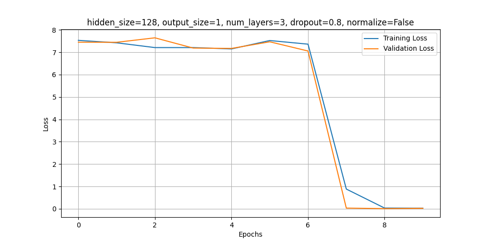

# Assignment 5 Report


## 2. KDE 

The KDE class is written in `models.KDE.kde.ppy` with the required methods including fit, predict and visualize.

The required synthetic data is generated by uniformly genrating points within a circle of radius 2. The dense portion of the dataset was also genrated by randomly generating points within a circle of radius 0.25 units. Normal Gaussian noise is then added to the datapoints.

to run this section of the code

```console
python3 -m assignments.5.2.2
```


The contours in the KDE plot represent regions of varying probability density based on the underlying distribution of the data points. Each contour corresponds to a constant density level, with the innermost contours indicating areas of higher density where data points are more concentrated. The color gradient visually emphasizes these variations, with brighter regions denoting higher densities.

The GMM plot differs because it models the data using two Gaussian components, which smooth the density distribution and emphasize the most prominent cluster near `(1, 1)`. This approach assumes the data is generated from a mixture of Gaussians, leading to broader density contours compared to KDE. As the number of components in the GMM increase the graph gets more differentiated due to the GMM predicting the noise better.

to run this section of the code

```console
python3 -m assignments.5.2.3
```

Thus we can see the comparative plots between the KDE and GMM is shown below


The KDE model fits the data consistently because it does not assume any predefined distribution and instead estimates the density directly from the data points.

## 3. HMM

The viualization of the MFCC of the audio files:

to run this section of the code

```console
python3 -m assignments.5.3.2
```


Using HMMs for classifying audio files based on MFCC features is effective because they model sequential data, handle temporal dependencies in speech, and are computationally efficient.

Evaluating Metrics for HMM:-
We get an accurate reading of the audio files on the test set with an accuracy of 89%

to run this section of the code

```console
python3 -m assignments.5.3.3
```

owever we do not get as good as an accuracy on the custom dataset we use using our audio recordings with about 10% accuracy

to run this section of the code

```console
python3 -m assignments.5.3.4
```

This is likely due to difference in dataset in terms of the audio quality, noise levels etc. also the environmental factors like noise from other sources may cause in accuracies in the data.


## 4. RNN
We use a reccurent neural network (RNN) to count the number of bits in a sequence. We generate the sequence from 1,16 bits ad then pad it to max length i.e 16.
Example :-

To run this section of the code:
```console
python3 -m assignments.5.4.1.1
```

The bit counter RNN is then trained in the section:
```console
python3 -m assignments.5.4.1.2
```

We do hyperparameter tuning for different dropout probabilities, normalization states

- **Hidden Sizes**:  
  - 64  
  - 128
- **Number of Layers**:  
  - 2  
  - 3  
- **Dropout Rates**:  
  - 0.5  
  - 0.8  
- **Normalize Options**:  
  - True  
  - False  

Plotting the train and validation losses we see,





To run this section of the code:
```console
python3 -m assignments.5.4.1.3
```

Plotting the metrics for generalization from 0 to 32 we get


```console
python3 -m assignments.5.4.1.4
```

As w can see the model performs the best for bit length = 16 while not very well as the lengths diverge from it as the model was trained onlength 16 bit sequences. The model performs worse when the input structure is tested on sequences of different lengths since it no longer meets the model's expectations. 


## CNN+RNN
We use a CNN encoder and a RNN decoder to predict characters in a text image. We get the the dataset from NLTK (Natural Language Toolkit) which contains a corpus of words which we project onto a 256x64 image. Only words of length 9 or lesser were used as any greater could run the risk of the text not fitting in the image

To form the dataset, we 
```console
python3 -m assignments.5.4.2.1
```

Example :-


The ocr is then trained in the following section of the code :
```console
python3 -m assignments.5.4.2.2
```
we see that the model performs with a validation accuracy of 80%
